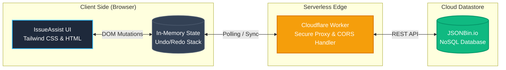

# IssueAssist - Lightweight IT Operations & Incident Management Dashboard

> A purpose-built operations dashboard for small IT teams managing internal issue resolution, role-based task routing, and incident audit trails - designed as a practical alternative to enterprise ITSM tools for organizations that can't afford ServiceNow.

**[🌐 View Live Deployment](https://issue-assist.sejabur.dev)**

## The Problem

Enterprise ITSM (IT Service Management) tools are often bloated, expensive, and require weeks of configuration. Small IT teams and rapid-response operations centers need a lightweight, zero-latency dashboard that provides immediate situational awareness, role-based task routing, and bulk incident management out of the box. IssueAssist solves this by providing a highly tactile, lightning-fast interface for coordinating urgent issues across teams without the overhead of heavy enterprise infrastructure.

## Key Features

* **High-Velocity Issue Triage:** A lightning-fast, tactile interface for routing and updating IT incidents without the page-reload latency of traditional ticketing systems.
* **Urgent Incident Pings:** A dedicated, permanently visible sidebar for critical alerts, ensuring severe outages are never buried in a queue. Users can ping specific rows to immediately draw network-wide attention to critical records.
* **Bulk Operations & Atomic Rollbacks:** Select multiple incidents to bulk-update statuses or delete records. A custom state-history engine allows immediate undo/redo of mass mutations.
* **Role-Based Task Routing (RBAC):** Strict separation of privileges isolating Administrative configuration panels from standard Operator triage views to prevent unauthorized system changes.
* **Session Audit Trails:** Comprehensive logging of all operational modifications, providing clear accountability during rapid incident response.
* **Dark & Light Mode:** Seamless, persistent theme toggling utilizing localStorage and Tailwind CSS dark mode variants.

## Architecture & Technical Decisions



* **Serverless Edge API:** Real-time data synchronization is powered by a custom Cloudflare Worker acting as a secure proxy to a JSONBin.io NoSQL datastore. This edge-routing completely bypasses CORS restrictions and securely manages the persistence layer without a traditional monolithic backend.
* **Optimistic State Engine:** Utilizes an advanced client-side state machine (Vanilla JS) that processes mutations locally for zero-latency UI updates while the Cloudflare Worker synchronizes the global state in the background.
* **Event Delegation Layer:** Custom interactive components (dropdowns, modals) are managed via optimized event delegation (`e.stopImmediatePropagation()`) and strict `z-index` contexts, eliminating event-bubbling bottlenecks common in dense operational dashboards.
* **Tailwind UI Framework:** Fully responsive, dark-mode-native interface constructed with Tailwind CSS utility classes to ensure a seamless experience from mobile incident-response to NOC (Network Operations Center) multi-monitor setups.

## Installation & Deployment

IssueAssist is designed for instant deployment and immediate operational use.

1. **Clone the repository:**
   ```bash
   git clone https://github.com/Sejabur/issue-assist.git
   cd issue-assist
   ```
2. **Serve locally:**
   You can use any standard HTTP server to run the application. If you have Node.js installed, use serve:
   ```bash
   npx serve .
   ```
   *Alternatively, you can utilize the VS Code "Live Server" extension.*
3. **Open in Browser:** Navigate to `http://localhost:3000/` or `http://localhost:3000/index.html`

## API Configuration (JSONBin + Cloudflare Worker)

If you are deploying your own instance, you will need to configure the backend datastore:

1. Create a free account at [JSONBin.io](https://jsonbin.io/).
2. Create a new bin with the following default schema structure:
   ```json
   { "records": [], "audit_log": [], "auth": { "admin": { "username": "admin", "password": "your_secure_password" }, "operators": [] } }
   ```
3. Copy the Bin ID and your API Key.
4. Deploy a Cloudflare Worker using the provided code in `cloudflare_worker.js` (you can find this script in your repository if provided, or simply create a proxy that forwards GET/PUT requests to JSONBin and handles CORS).
5. Open `index.html`, locate `const CLOUDFLARE_WORKER_URL = '...'`, and replace it with your new Worker URL.

## Disclaimer

**Please Note:** This application is provided as a public demo and a portfolio showcase. **It is not actively maintained**, and the author takes no responsibility for any data loss or operational issues that may arise from using this software in full production.

## License

This project is licensed under the MIT License - see the LICENSE file for details.
